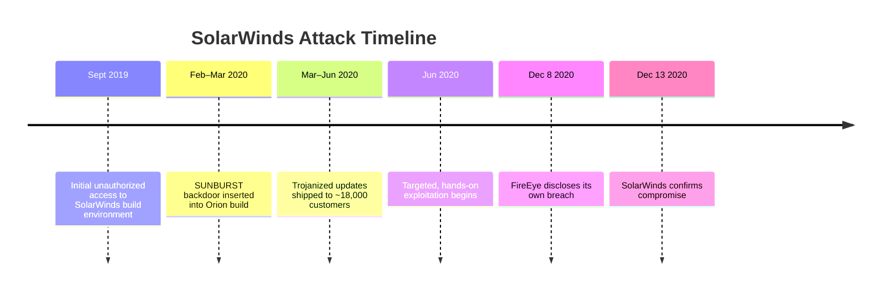
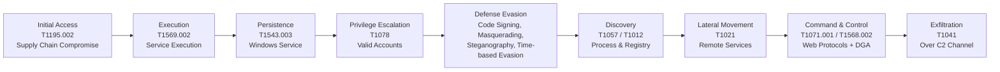
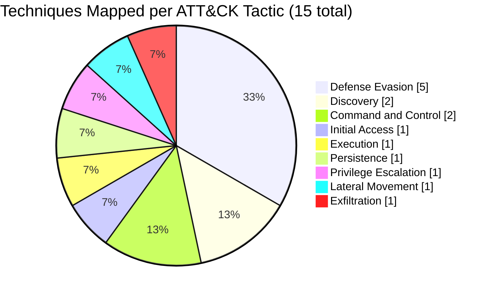

# Threat Intelligence Report: SolarWinds / SUNBURST Supply Chain Compromise

**Classification:** Educational / Training Use
**Author:** Sandeepta Mahanta
**Track:** Blue Team — GraySentinel Global Cybersecurity Sprint, Day 2
**Framework Reference:** MITRE ATT&CK for Enterprise
**Threat Actor:** UNC2452 / APT29 (assessed, state-sponsored)

---

## Table of Contents

1. [Executive Summary](#executive-summary)
2. [Incident Background](#incident-background)
3. [Attack Timeline](#attack-timeline)
4. [Attack Chain Overview](#attack-chain-overview)
5. [MITRE ATT&CK Technique Mapping](#mitre-attck-technique-mapping)
6. [Attack Analytics & Visualizations](#attack-analytics--visualizations)
7. [Impact Assessment](#impact-assessment)
8. [Detection & Mitigation Recommendations](#detection--mitigation-recommendations)
9. [Key Takeaways](#key-takeaways)
10. [Project Structure](#project-structure)
11. [5-Line Summary](#5-line-summary)
12. [Sources](#sources)

---

## Executive Summary

In December 2020, incident responders at FireEye discovered that their
own network had been breached, and traced the intrusion to a
trojanized update of the **SolarWinds Orion Platform**, a network
monitoring product used by an estimated 33,000+ organizations
globally. A state-sponsored threat actor, tracked as **UNC2452**
(later associated with **APT29 / Cozy Bear**), had compromised
SolarWinds' software build pipeline and embedded a backdoor —
codenamed **SUNBURST** — into a legitimately signed Orion component.

Approximately **18,000 customers** downloaded the compromised update
between March and June 2020, including multiple branches of the U.S.
federal government (Treasury, Commerce, State Department, DHS) and
numerous Fortune 500 companies. From this broad set of victims, the
threat actor used automated fingerprinting to identify and select a
much smaller number of high-value targets for direct, hands-on
exploitation using tools such as the **TEARDROP** dropper and **Cobalt
Strike Beacon**.

This report reconstructs the attack lifecycle and maps each stage to
the MITRE ATT&CK for Enterprise framework, providing a structured
reference for how the intrusion evolved from a single supply-chain
compromise into a sustained, multi-organization espionage campaign.

**Severity Assessment:** Critical — nation-state actor, supply-chain
vector, government and critical-infrastructure targets, ~9 months
dwell time before detection.

---

## Incident Background

| Field | Detail |
|---|---|
| **Victim organization (initial)** | SolarWinds Corporation |
| **Affected product** | Orion Platform (versions 2019.4 HF5, 2020.2, 2020.2 HF1) |
| **Malware family** | SUNBURST (backdoor), TEARDROP (dropper), Cobalt Strike Beacon |
| **Compromised component** | `SolarWinds.Orion.Core.BusinessLayer.dll` |
| **Delivery mechanism** | Legitimate, digitally-signed automatic software update |
| **Estimated affected downloads** | ~18,000 organizations |
| **Discovery** | FireEye, during investigation of its own breach (Dec 8, 2020) |
| **Attribution** | UNC2452 / APT29 (Russian state-sponsored, assessed) |

---

## Attack Timeline

| Date | Event |
|---|---|
| Sept 2019 | Threat actor gains unauthorized access to SolarWinds' internal build environment |
| Feb–Mar 2020 | SUNBURST backdoor inserted into the Orion software build via the SUNSPOT implant |
| Mar–Jun 2020 | Trojanized Orion updates distributed to ~18,000 customers via official update channel |
| Jun 2020 | Threat actor begins selective, hands-on-keyboard exploitation of high-value victims |
| Dec 8, 2020 | FireEye discloses its own breach, traces root cause to SolarWinds |
| Dec 13, 2020 | SolarWinds publicly confirms the Orion supply-chain compromise |
| 2021+ | Federal investigations, remediation, and industry-wide supply-chain security reforms begin |



*Roughly 9 months elapsed between initial access (Sept 2019) and
public disclosure (Dec 2020) — a dwell time far longer than the
industry median, largely due to the defense-evasion techniques
detailed below.*

---

## Attack Chain Overview



*Diagram renders natively on GitHub. Each node maps to the detailed
technique breakdown below.*

---

## MITRE ATT&CK Technique Mapping

### 1. Initial Access
**T1195.002 — Supply Chain Compromise: Compromise Software Supply Chain**

The threat actor did not exploit a conventional vulnerability. Instead,
they compromised SolarWinds' internal build and distribution pipeline
and inserted malicious code directly into a trusted DLL
(`SolarWinds.Orion.Core.BusinessLayer.dll`). Because the tampered file
was digitally signed and distributed through SolarWinds' own
legitimate auto-update mechanism, it bypassed code-signing validation,
antivirus detection, and application allow-listing at every one of the
~18,000 downstream organizations.

### 2. Execution
**T1569.002 — System Services: Service Execution**

Upon installation, the trojanized DLL was loaded by the legitimate
`SolarWinds.BusinessLayerHost.exe` process and executed as a standard
Windows service — inheriting the trust and permission level of the
software it was hidden inside.

### 3. Persistence
**T1543.003 — Create or Modify System Process: Windows Service**

Because the backdoor was embedded inside a component that already ran
as a Windows service, it persisted automatically across reboots
without requiring a separate persistence mechanism — a key reason it
went undetected for so long.

### 4. Privilege Escalation
**T1078 — Valid Accounts**

Rather than exploiting a local privilege-escalation vulnerability, the
threat actor harvested legitimate credentials from victim
environments (in some cases forging SAML authentication tokens),
allowing them to operate with the access level of trusted, authorized
accounts.

### 5. Defense Evasion
This tactic received the heaviest investment in the campaign:

| Technique ID | Name | Observed Behavior |
|---|---|---|
| T1553.002 | Subvert Trust Controls: Code Signing | Malicious DLL signed with a legitimate SolarWinds certificate |
| T1036.005 | Masquerading: Match Legitimate Name/Location | C2 traffic disguised as Orion Improvement Program (OIP) protocol |
| T1497.003 | Virtualization/Sandbox Evasion: Time Based Evasion | Backdoor delayed C2 beaconing up to 2 weeks post-install |
| T1027.003 | Obfuscated Files or Information: Steganography | TEARDROP payload hidden inside a JPEG file (`gracious_truth.jpg`) |
| T1070.004 | Indicator Removal on Host: File Deletion | Tools and backdoors deleted post-use to reduce forensic footprint |

### 6. Discovery
**T1057 — Process Discovery** and **T1012 — Query Registry**

The malware enumerated running processes to profile installed
security tooling, and queried the Windows Registry (`MachineGuid`) to
generate a unique per-victim identifier — enabling the threat actor to
selectively prioritize specific organizations for deeper compromise.

### 7. Lateral Movement
**T1021 — Remote Services**

Using previously harvested valid credentials, the threat actor moved
between systems via legitimate remote access protocols (e.g., RDP),
blending in with normal administrative activity.

### 8. Command and Control
| Technique ID | Name | Observed Behavior |
|---|---|---|
| T1071.001 | Application Layer Protocol: Web Protocols | C2 traffic disguised as ordinary HTTP GET/POST/PUT requests to `avsvmcloud[.]com` |
| T1568.002 | Dynamic Resolution: Domain Generation Algorithms | DGA used to generate C2 subdomains dynamically, evading static blocklists |

### 9. Exfiltration
**T1041 — Exfiltration Over C2 Channel**

Stolen data was sent out over the same HTTP-based C2 channel used for
command traffic: HTTP PUT for payloads over 10,000 bytes, HTTP POST
for smaller payloads — avoiding the need for a separate, more
detectable exfiltration channel.

---

## Attack Analytics & Visualizations

### Technique Distribution by Tactic

Out of 15 mapped techniques across the attack lifecycle, **Defense
Evasion accounts for the largest share (5 techniques, one-third of the
total)** — reflecting how much of this campaign's success depended on
staying hidden rather than on any single exploit.



| Tactic | Technique Count |
|---|---|
| Defense Evasion | 5 |
| Discovery | 2 |
| Command and Control | 2 |
| Initial Access | 1 |
| Execution | 1 |
| Persistence | 1 |
| Privilege Escalation | 1 |
| Lateral Movement | 1 |
| Exfiltration | 1 |

### Severity / Impact Comparison by Tactic

Severity here reflects how much damage or exposure each tactic
contributed to the overall campaign, not how many techniques were
used at that stage.

| Tactic | Severity | Rationale |
|---|---|---|
| Initial Access | 🔴 High | Single point of compromise cascaded to ~18,000 downstream organizations |
| Defense Evasion | 🔴 High | Directly responsible for ~9 months of undetected dwell time |
| Command and Control | 🔴 High | Enabled sustained remote access to high-value targets |
| Privilege Escalation | 🟠 Medium-High | Valid-account abuse gave broad, hard-to-distinguish access |
| Lateral Movement | 🟠 Medium-High | Allowed spread within victim networks using legitimate protocols |
| Exfiltration | 🟠 Medium-High | Data loss impact varies significantly by victim organization |
| Persistence | 🟡 Medium | Reused existing service execution rather than a novel mechanism |
| Execution | 🟡 Medium | Necessary step, but not independently evasive |
| Discovery | 🟢 Low-Medium | Supported target selection but did not directly cause damage |

*Severity ratings are qualitative assessments made for this report
based on the role each tactic played in enabling the broader
campaign, not an official MITRE or vendor scoring.*

---

## Impact Assessment

| Category | Assessment |
|---|---|
| **Scope** | ~18,000 organizations received the backdoored update; a much smaller, high-value subset were actively exploited |
| **Sectors affected** | U.S. federal government, critical infrastructure, Fortune 500 technology and consulting firms |
| **Dwell time** | Approximately 9 months between initial compromise and public disclosure |
| **Data at risk** | Internal communications, source code (including Microsoft and FireEye's own red-team tooling), government correspondence |
| **Detection difficulty** | Very high — malware was signed, evasive, and blended into legitimate traffic patterns |

---

## Detection & Mitigation Recommendations

| Technique | Recommended Control |
|---|---|
| Supply Chain Compromise (T1195.002) | Maintain a Software Bill of Materials (SBOM); verify build integrity independent of vendor signatures |
| Service Execution / Persistence (T1569.002, T1543.003) | Monitor for unexpected child processes or DLL loads from trusted binaries |
| Valid Accounts (T1078) | Enforce MFA; monitor for anomalous use of privileged/service accounts |
| Code Signing Abuse (T1553.002) | Treat code-signing as necessary but not sufficient; combine with behavioral monitoring |
| Masquerading (T1036.005) | Baseline expected outbound traffic patterns; flag protocol mismatches |
| Time-Based Evasion (T1497.003) | Extend sandbox analysis windows beyond typical 24–48 hour limits |
| DGA-based C2 (T1568.002) | Deploy DNS analytics capable of flagging algorithmically-generated domains |
| Exfiltration over C2 (T1041) | Monitor for abnormal outbound data volume over otherwise "normal" web traffic |

---

## Key Takeaways

- **Behavioral detection over signatures** — since the malware was
  digitally signed and mimicked legitimate traffic, only
  behavior-based and anomaly-based detection had a realistic chance of
  catching it.
- **Zero Trust reduces blast radius** — perimeter-based trust models
  failed here; treating vendor software and internal traffic as
  unverified by default would have slowed the attackers down.
- **Supply-chain integrity is now a baseline control** — verifying
  what's actually in a vendor's build output, not just trusting a
  valid signature, is essential post-SolarWinds practice.
- **Credential hygiene matters as much as malware detection** — a
  majority of this campaign's lateral movement relied on valid,
  stolen credentials rather than exploits.

---

## Project Structure

```
MITRE-ATTACK-SolarWinds/
├── README.md                  # This report
├── screenshots/
│   ├── 01_setup.png            # Repository / report setup view
│   ├── 02_output.png           # Rendered ATT&CK mapping section
│   └── 03_findings.png         # Close-up of a key finding
├── logs/                       # Not applicable — research project, no script output
└── evidence/
    └── sample_data.txt          # Source list used for this analysis
```

---

## 5-Line Summary

I researched the 2020 SolarWinds/SUNBURST supply-chain attack and
mapped its full attack lifecycle to the MITRE ATT&CK for Enterprise
framework across nine tactics. The threat actor compromised
SolarWinds' build pipeline to distribute a digitally-signed, trojanized
DLL, then relied on layered defense-evasion techniques — code-signing
abuse, masquerading, time-based evasion, and steganography — to remain
undetected for roughly nine months. Privilege escalation and lateral
movement were achieved through valid stolen credentials rather than
exploits, and stolen data was exfiltrated over the same HTTP-based
channel used for command and control. This report includes technique-
level detection and mitigation guidance and visual analytics on
technique distribution and severity, underscoring why supply-chain and
identity-based attacks require behavioral defenses rather than
signature-based tools alone.

---

## Sources

1. FireEye/Mandiant. *"Highly Evasive Attacker Leverages SolarWinds
   Supply Chain to Compromise Multiple Global Victims With SUNBURST
   Backdoor."* December 2020.
   https://www.fireeye.com/blog/threat-research/2020/12/evasive-attacker-leverages-solarwinds-supply-chain-compromises-with-sunburst-backdoor.html
2. Picus Security. *"Tactics, Techniques, and Procedures (TTPs) Used
   in the SolarWinds Breach."*
   https://www.picussecurity.com/resource/blog/ttps-used-in-the-solarwinds-breach
3. Microsoft Security Response Center. *"Customer Guidance on Recent
   Nation-State Cyber Attacks."* December 2020.
   https://msrc-blog.microsoft.com/2020/12/13/customer-guidance-on-recent-nation-state-cyber-attacks/
4. MITRE ATT&CK for Enterprise.
   https://attack.mitre.org/techniques/enterprise/

---

*This report was prepared for educational purposes as part of the
GraySentinel Global Cybersecurity Sprint. No live systems, malware
samples, or victim data were accessed in the preparation of this
analysis; all findings are derived from publicly available incident
response reporting.*
